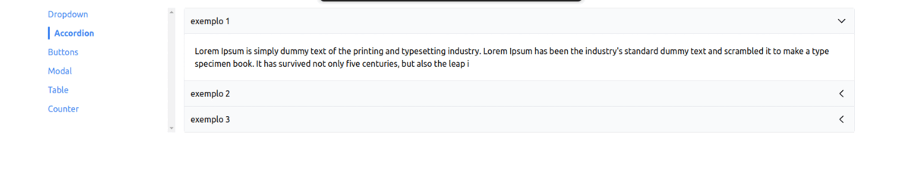

# Learning React Navigation and Routing Project

This project is dedicated to learning. The main focus is on understanding and implementing the core concepts of React, such as state management, handling events, using props, and designing reusable components.

## Goals

The primary goals of this project are:

- **Practice**: Gain hands-on experience with state, events, props, and component design.
- **Build Common Components**: Develop a set of common components that can be reused across different projects.
- **Navigation**: Learn and implement navigation in a React application.
- **Styling**: Understand and apply different methods of styling in React.
- **Larger App**: Apply the learned concepts and build a larger, more complex application.
